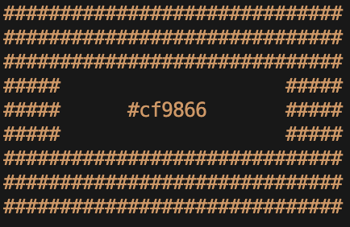

# Random Color Generator (Node.js)

The Random Color Generator benates a grid of `#` (hashes)

## Installation

1. Clone the project

```bash
git clone https://github.com/phreis/node-random-color-generator
```

2. Install dependencies

```bash
npm install
```

## Usage

- To generate Grid in random color:

```bash
node index.js
```

- To generate Grind with spcified `hue` (e.g. green or red or blue)
  node index.js [hue]

```bash
node index.js red
```

- To generate Grind with spcified `hue` (e.g. green or red or blue) and `luminosity` (e.g. light or dark):
  node index.js [hue] [light|dark]

```bash
node index.js blue dark
```
